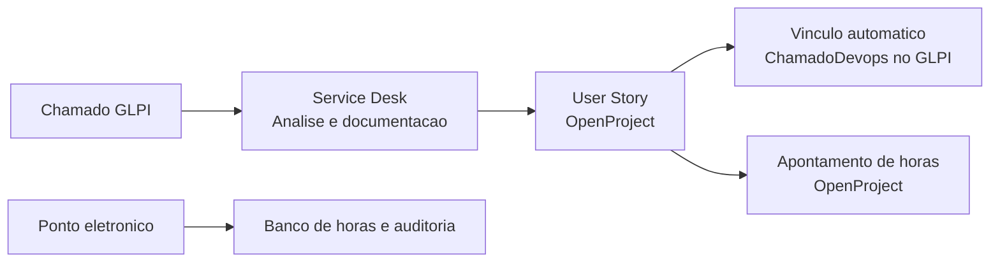

# Axiom Atlas

Plataforma interna para transformar demandas de Service Desk em trabalho rastreavel, conectando GLPI, OpenProject, apontamentos de tempo e controle de ponto em uma unica operacao.

## Visao geral

O Axiom Atlas centraliza o fluxo de valor da Engenharia de Requisitos:



O sistema foi desenhado para manter rastreabilidade entre a necessidade original, a User Story criada para atende-la e o tempo efetivamente registrado.

## Capacidades atuais

### Service Desk e GLPI

- Configuracao de GLPI por ambiente de homologacao e producao.
- Autenticacao segura por `APP_TOKEN` e `USER_TOKEN`, com sessao GLPI reutilizavel.
- Descoberta dinamica dos campos do plugin Fields, incluindo classificacao e `ChamadoDevops`.
- Fila de solicitacoes de melhoria classificadas no GLPI, com filtros de status, paginacao e ordenacao pelos chamados mais antigos.
- Cache local com estrategia stale-while-revalidate: a lista local aparece rapidamente e e atualizada em segundo plano.
- Tela de tratamento do chamado com conteudo HTML higienizado, acompanhamentos em formato de conversa, anexos e visualizacao ampliada de imagens.
- Editor Markdown para analise e documentacao da User Story, com salvamento de rascunho.
- Criacao da User Story no OpenProject e preenchimento dos campos de rastreabilidade `Cliente`, `ServiceDesk` e `Link ServiceDesk`.
- Registro do link da Work Package no campo `ChamadoDevops` do GLPI.
- Consulta de status, criador e idade da Work Package na fila de melhorias quando o vinculo esta presente no GLPI.

### OpenProject e apontamentos

- Configuracao de OpenProject por ambiente, com tokens protegidos em repouso.
- Validacao da conexao e pesquisa de Work Packages por identificador ou texto.
- Carregamento das atividades de tempo permitidas para a Work Package e seu projeto.
- Lancamento, edicao antes da sincronizacao e sincronizacao de horas com o OpenProject.
- Links para Work Packages e entradas remotas, respeitando o identificador do projeto no OpenProject.
- Protecao e aviso para lancamentos ja sincronizados, evitando quebra de rastreabilidade remota.
- Monitoramento de Work Packages e notificacoes de area de trabalho para responsaveis quando o status mudar para `Test failed` ou `Rejected`.

### Ponto eletronico

- Configuracao individual de jornada: entrada, saida e intervalo.
- Configuracao global e administrativa de tolerancia de ponto.
- Calendario mensal para multiplas marcacoes por dia, com tipos inteligentes de entrada e saida, NSR e observacao.
- Ausencias integrais ou parciais, faltas sem justificativa, anexos e reflexo no calendario.
- Auditoria do ponto, saldo mensal e banco de horas acumulado.
- Tratamento de sabados, domingos, ausencias e dias futuros sem incidencia indevida no banco de horas.

### Governanca e operacao

- Usuarios, perfis e controle de acesso administrativo.
- Auditoria persistida de alteracoes relevantes.
- Fila persistida de integracoes, com tentativas automaticas, reprocessamento manual e diagnosticos tecnicos seguros.
- Tela de Operacoes de integracao para acompanhar estados pendentes, em execucao, concluidos e com falha.
- Breadcrumbs, toasts e componentes alinhados ao padrao visual Metronic utilizado pelo produto.

## Arquitetura

O repositorio segue uma separacao em camadas, mantendo regras de negocio independentes de infraestrutura e interface:

| Projeto | Responsabilidade |
| --- | --- |
| `Axiom.Atlas.Domain` | Entidades, contratos e regras centrais de dominio. |
| `Axiom.Atlas.Application` | Casos de uso, DTOs, interfaces e servicos de aplicacao. |
| `Axiom.Atlas.Persistence` | `AppDbContext`, migracoes EF Core e persistencia PostgreSQL. |
| `Axiom.Atlas.Infrastructure` | Repositorios, integracoes externas, autenticacao, e-mail e notificacoes. |
| `Axiom.Atlas.API` | API REST, autenticacao JWT, endpoints de saude e workers hospedados. |
| `Axiom.Atlas.Web` | Aplicacao ASP.NET Core MVC e interface baseada no template Metronic. |
| `Axiom.Atlas.Tests` | Testes automatizados de servicos e fluxos criticos. |

### Stack

- .NET 10 e ASP.NET Core.
- ASP.NET Core MVC para a interface Web.
- API REST com OpenAPI em desenvolvimento.
- Entity Framework Core 10 e PostgreSQL.
- ASP.NET Core Identity, roles e JWT.
- Audit.NET para trilha de auditoria.
- xUnit e SQLite em memoria para testes.
- GitHub Actions para integracao continua e releases.

## Fluxos de negocio principais

### Da solicitacao a User Story

1. O GLPI recebe um chamado classificado como solicitacao de melhoria.
2. O Axiom Atlas atualiza a fila local e exibe o chamado para tratamento.
3. O analista consulta descricao, acompanhamentos e anexos, documentando a User Story em Markdown.
4. A User Story e criada no projeto selecionado do OpenProject.
5. O Axiom Atlas envia cliente, numero e link do ticket aos campos de rastreabilidade da Work Package.
6. O link gerado da Work Package e gravado no campo `ChamadoDevops` do GLPI.
7. O time realiza apontamentos de horas na User Story e os sincroniza com o OpenProject.

### Confiabilidade das integracoes

1. Operacoes remotas relevantes sao registradas em fila persistida.
2. Em falhas transitivas, o worker tenta novamente ate o limite configurado.
3. A tela `Integracoes > Operacoes` mostra estado, numero de tentativas e detalhe tecnico da falha.
4. Operacoes que esgotaram as tentativas podem ser reprocessadas manualmente.
5. Reinicializacoes da API nao descartam a fila pendente.

## Requisitos locais

- .NET SDK 10.
- PostgreSQL acessivel localmente ou por rede.
- Certificado de desenvolvimento confiavel para executar os perfis HTTPS locais.
- Credenciais validas de ambientes de homologacao para GLPI e OpenProject, cadastradas pela interface administrativa.

## Como executar localmente

### 1. Restaurar dependencias e compilar

```powershell
dotnet restore Axiom.Atlas.slnx
dotnet build Axiom.Atlas.slnx
```

### 2. Configurar o banco e os segredos locais

Nao versione segredos. Crie um `appsettings.Development.json` ou use User Secrets/variaveis de ambiente para a API.

Exemplo de configuracao minima da API:

```json
{
  "ConnectionStrings": {
    "DefaultConnection": "Host=localhost;Port=5432;Database=AxiomAtlasDb;Username=postgres;Password=<senha>"
  },
  "JwtSettings": {
    "SecretKey": "<segredo-local-com-pelo-menos-32-caracteres>",
    "Issuer": "AxiomAtlasApi",
    "Audience": "AxiomAtlasWeb"
  }
}
```

Para a aplicacao Web, mantenha a URL da API:

```json
{
  "ApiSettings": {
    "BaseUrl": "https://localhost:7255/"
  }
}
```

### 3. Aplicar migracoes

```powershell
dotnet ef database update --project Axiom.Atlas.API --startup-project Axiom.Atlas.API
```

### 4. Iniciar API e Web

Em dois terminais:

```powershell
dotnet run --project Axiom.Atlas.API --launch-profile https
```

```powershell
dotnet run --project Axiom.Atlas.Web --launch-profile https
```

| Servico | URL HTTPS local |
| --- | --- |
| Web | `https://localhost:7204` |
| API | `https://localhost:7255` |
| OpenAPI em desenvolvimento | `https://localhost:7255/swagger` |

## Integracoes

### GLPI 10

As configuracoes sao feitas pela interface em `Integracoes > GLPI Service Desk`, separadas por ambiente. A URL deve usar HTTPS.

O Axiom Atlas inicia sessoes no GLPI com os headers abaixo:

```text
App-Token: <APP_TOKEN>
Authorization: user_token <USER_TOKEN>
```

Depois da inicializacao, as chamadas autenticadas usam `App-Token` e `Session-Token`. O sistema gerencia o ciclo de vida da sessao, o cache de sessao e a descoberta dos IDs dos campos do plugin Fields. Nenhum token deve ser registrado no repositorio, em logs ou em capturas de tela.

### OpenProject

As configuracoes sao feitas em `Integracoes > OpenProject`, tambem com separacao por ambiente. O Axiom Atlas usa a configuracao selecionada para:

- pesquisar Work Packages;
- listar atividades permitidas para apontamento;
- criar User Stories;
- enviar apontamentos de tempo;
- monitorar status de Work Packages;
- consultar metadados das Work Packages vinculadas aos chamados GLPI.

## Qualidade e verificacao

Execute a suite automatizada com:

```powershell
dotnet test Axiom.Atlas.slnx
```

O workflow de Integracao Continua executa restore, build em `Release` e testes para pull requests e atualizacoes da branch `main`.

## Health checks

Os endpoints abaixo sao anonimos e devem ser usados por monitoramento:

| Endpoint | Finalidade |
| --- | --- |
| `GET /health/live` | Confirma que a API esta em execucao. |
| `GET /health/ready` | Confirma que a API consegue acessar o banco PostgreSQL. |

Exemplos locais:

```text
https://localhost:7255/health/live
https://localhost:7255/health/ready
```

## Publicacao e seguranca

- Utilize `ASPNETCORE_ENVIRONMENT=Production` em producao.
- Configure HTTPS entre navegador, Web e API.
- Guarde connection strings, JWT, credenciais de SMTP e tokens de integracao em cofre de segredos ou variaveis protegidas.
- Em producao, `DataProtection__KeysPath` e obrigatorio e deve apontar para um diretorio persistente e restrito. Ele preserva a capacidade de descriptografar configuracoes de integracao apos atualizacoes e reinicializacoes.
- O cookie da aplicacao Web exige HTTPS em producao.
- A API nao ignora certificados TLS em producao; a tolerancia a certificados autoassinados e restrita ao ambiente de desenvolvimento.

O guia detalhado esta em [docs/ProductionConfiguration.md](docs/ProductionConfiguration.md).

## Versionamento e releases

Cada push em `main` aciona o workflow de release. Ele:

1. compara o `VersionPrefix` do projeto Web com a ultima tag semantica `vMAJOR.MINOR.PATCH`;
2. incrementa automaticamente o `PATCH` usando o `version-update.js`;
3. grava a nova versao em `Axiom.Atlas.Web.csproj` e a persiste na `main` com um commit automatico;
4. compila e publica API e Web usando essa mesma versao;
5. gera pacotes ZIP de distribuicao, a tag Git e a GitHub Release com notas automaticas.

Depois de uma release, ambientes locais e de teste devem receber o commit automatico da `main` e ser reiniciados ou recompilados para que o badge lateral exiba a nova versao.

O workflow de CI continua validando build e testes antes da integracao das alteracoes.

## Documentacao complementar

- [Configuracao de producao](docs/ProductionConfiguration.md)
- [Workflows GitHub Actions](.github/workflows/ci.yml)
- [Workflow de release](.github/workflows/release.yml)

## Convencoes de contribuicao

- Nunca inclua senhas, tokens, connection strings reais ou anexos de clientes em commits.
- Mantenha migracoes de banco junto de alteracoes de modelo persistente.
- Acrescente testes quando alterar regras de negocio, fila de integracao ou calculos de ponto.
- Valide a interface nos temas claro e escuro quando alterar componentes visuais.
- Use pull requests para revisao, CI e rastreabilidade de cada evolucao.
