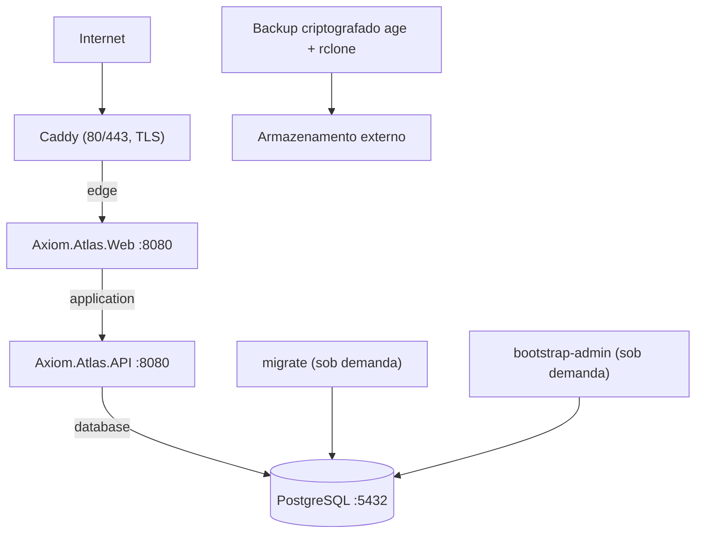

# Arquitetura de produção

Somente o Caddy publica `80/tcp` e `443/tcp`. Web, API e PostgreSQL não possuem portas publicadas. As redes `application` e `database` são internas; a API só é alcançada pela Web na rede Docker.

O GitHub constrói, testa e publica imagens imutáveis no GHCR. O workflow de release calcula a versão a partir da maior tag estável e do `VersionPrefix` apenas como fallback; ele não faz commit nem push na `main`. A tag `vX.Y.Z` é criada no próprio SHA que disparou o workflow e os binários recebem essa versão e SHA por propriedades MSBuild. A VPS apenas faz pull das imagens por versão, aplica migrations com o container temporário e inicia os serviços. Ela nunca compila o projeto.

| Atividade | Responsável |
| --- | --- |
| Release, imagens e ZIPs | GitHub Actions |
| Migração, deploy, rollback e backup | administrador na VPS / workflow manual aprovado |
| TLS e proxy | Caddy na VPS |
| VPS, IP e console de recuperação | Locaweb |
| DNS, SMTP, GitHub Environment e segredos | proprietário do repositório |

Os volumes de PostgreSQL e Data Protection são persistentes. Nunca execute `docker compose down -v`: esse comando apaga os volumes e não faz parte de deploy, rollback ou recuperação.

As imagens são publicadas somente como `X.Y.Z` e `sha-<commit>`; não existe tag `latest`. Uma tentativa de reutilizar uma tag com revisão OCI diferente falha. Reexecuções do workflow no mesmo commit reutilizam a tag, imagens e rascunho de release existentes, permitindo reparar uma publicação interrompida sem criar uma segunda versão.

Veja [Versionamento e publicação](ReleaseVersioning.md) para o contrato completo entre tags, binários, imagens e assets.
